# Phase 2: Dynamic Grid World Experiments

## Overview

Phase 2 extends counterfactual RL from bandits (Phase 1) to navigation tasks with **dynamic environments**. The goal is to test whether counterfactual learning enables faster adaptation when environments change, by maintaining beliefs about alternative paths through world model simulations.

## Implemented Environments

### 1. Shifting Hazards Grid (`ShiftingHazardGrid`)
- **7×7 grid** with 3 trap cells that relocate every 50 episodes
- **Trap penalty**: -5, **Goal reward**: +10
- **CF advantage**: After hitting a trap, the agent simulates "what if I took the other path?" to learn safe routes without exhaustive exploration. When traps shift, it leverages prior knowledge of alternative paths.

### 2. Depleting Resources Grid (`DepletingResourceGrid`)
- **7×7 grid** with 4 goal locations whose rewards drift via Gaussian random walk (σ=0.05)
- **Starting values**: [8.0, 5.0, 5.0, 3.0]
- **CF advantage**: After reaching one goal, post-episode counterfactual feedback reveals other goals' current values, enabling simultaneous tracking of the global reward landscape.

### 3. Moving Obstacles Grid (`MovingObstacleGrid`)
- **9×9 grid** with 2 obstacles patrolling predictable paths (vertical/horizontal/circular)
- **Collision penalty**: -5, **Goal reward**: +10
- **CF advantage**: After taking route A, the world model simulates routes B/C to assess relative danger from single observations of obstacle positions.

## Agent Variants

Each scenario compares 6 agent types:

1. **Counterfactual**: α=0.8, γ_cf=0.05 (full CF mechanism)
2. **Standard**: α=0, γ_cf=0 (vanilla Q-learning)
3. **HighExploration**: α=0, γ_cf=0, ε=0.3 (3× exploration)
4. **OracleCounterfactual**: Perfect world model + CF mechanism
5. **CompositeOnly**: α=1.0, γ_cf=0 (only composite error pathway)
6. **UnchosenOnly**: α=0, γ_cf=0.1 (only unchosen updates pathway)

## Theoretical Context: Regret-Based Learning vs Actor-Critic Methods

### Regret-Based Learning (Classic Literature)

**Definition**: Algorithms that minimize **regret**, defined as the difference between accumulated reward and the optimal policy's reward.

**Key Algorithms**:
- **UCB (Upper Confidence Bound)**: Multi-armed bandits
- **Thompson Sampling**: Bayesian bandit algorithms
- **Exp3**: Adversarial bandits
- **Regret Matching**: Game theory, poker AI

**Core Principle**:
```
Regret(T) = Σ(R_optimal - R_actual) over T timesteps
Goal: Minimize cumulative regret → O(log T) or O(√T)
```

**Mechanism**:
1. Maintain optimistic estimates or probability distributions over actions
2. **Explore actions with high uncertainty** (could be much better than current choice)
3. Balance exploration (reduce uncertainty) vs exploitation (maximize known rewards)
4. Theoretical guarantees on learning speed

**Example (UCB1 for Bandits)**:
```
Select action a = argmax_a [Q(a) + c·√(ln(t) / N(a))]
                            ^^^^^^^^  ^^^^^^^^^^^^^^^^^^
                            Exploit   Explore (uncertainty bonus)
```

**Strengths**:
- Strong theoretical guarantees (PAC bounds, regret bounds)
- Provably efficient exploration
- No credit assignment problem (bandits = one-step decisions)

**Limitations**:
- Primarily designed for **stateless** environments (bandits)
- Doesn't handle sequential decision-making well
- No value function approximation
- Doesn't use a world model

---

### Actor-Critic Methods (Modern Deep RL)

**Definition**: Algorithms that learn both a **policy** (actor) and **value function** (critic) simultaneously.

**Key Algorithms**:
- **A3C (Asynchronous Advantage Actor-Critic)**: Parallel training
- **PPO (Proximal Policy Optimization)**: Stable policy updates
- **SAC (Soft Actor-Critic)**: Maximum entropy RL
- **TD3 (Twin Delayed DDPG)**: Continuous control

**Core Principle**:
```
Actor:  π(a|s) → Policy that selects actions
Critic: V(s) or Q(s,a) → Value function that evaluates actions

Update rule:
Advantage A(s,a) = Q(s,a) - V(s) = "How much better is action a than average?"
Policy gradient: ∇θ J(θ) = E[∇θ log π(a|s) · A(s,a)]
```

**Mechanism**:
1. **Actor** proposes action based on current policy
2. **Critic** evaluates action quality using TD learning
3. **Actor** updates toward actions with positive advantage
4. **Critic** updates to better predict returns

**Example (A3C Update)**:
```
# Critic update (TD learning):
V(s) ← V(s) + α·[r + γ·V(s') - V(s)]
                   ^^^^^^^^^^^^^
                   TD error = Advantage

# Actor update (policy gradient):
π(a|s) ← π(a|s) + β·∇log(π(a|s))·Advantage
```

**Strengths**:
- Handles **sequential** decision-making (MDPs)
- Scales to high-dimensional continuous action spaces
- Can use function approximation (neural networks)
- On-policy or off-policy variants

**Limitations**:
- No theoretical regret bounds (heuristic)
- Sample inefficient (requires millions of environment interactions)
- Instability during training (high variance gradients)
- Doesn't explicitly model counterfactuals

---

### Comparison Table

| Feature | Regret-Based Learning | Actor-Critic | Counterfactual RL (This Project) |
|---------|----------------------|--------------|----------------------------------|
| **Primary Goal** | Minimize cumulative regret | Maximize expected return | Learn from unchosen actions |
| **Policy Type** | Implicit (via action selection) | Explicit policy π(a\|s) | Q-learning with CF updates |
| **Value Function** | Action values Q(a) | State/action values V(s), Q(s,a) | Q(s,a) + world model |
| **Exploration** | Optimism under uncertainty (UCB) | ε-greedy or entropy bonus | Counterfactual simulation |
| **Environment** | Stateless (bandits) | Sequential (MDPs) | Sequential (MDPs) |
| **Credit Assignment** | Not needed (one-step) | TD learning or Monte Carlo | TD + counterfactual TD |
| **Theoretical Guarantees** | ✅ Regret bounds (O(log T)) | ❌ No formal guarantees | 🔬 Empirical (this research) |
| **Sample Efficiency** | High (optimal for bandits) | Low (needs many samples) | High (learns from unchosen) |
| **World Model** | Not used | Not typically used | ✅ Required for CF simulation |
| **Handles Dynamics** | ❌ Stateless only | ✅ Full MDPs | ✅ Full MDPs + dynamics shifts |

---

### How Counterfactual RL (This Project) Differs

**This project combines ideas from both paradigms:**

**From Regret-Based Learning:**
- ✅ Uses **regret signals** (r_unchosen > r_chosen) to modulate learning (OFC α)
- ✅ Explores alternative actions via counterfactual simulation
- ✅ Aims for sample-efficient learning
- ❌ But extends to sequential decision-making (not just bandits)

**From Actor-Critic:**
- ✅ Handles sequential MDPs with credit assignment
- ✅ Uses value functions Q(s,a)
- ✅ TD learning for actual experience
- ❌ But also uses counterfactual TD for unchosen actions

**Key Innovation:**
```
Traditional Q-learning: Only updates chosen action
  Q(s, a_chosen) ← Q(s, a_chosen) + β·δ_actual

Counterfactual Q-learning: Also updates unchosen actions
  Q(s, a_chosen) ← Q(s, a_chosen) + β·δ_actual
  Q(s, a_other)  ← Q(s, a_other)  + γ_cf·δ_composite
                                          ^^^^^^^^^^^^
                                          Blends actual & counterfactual errors
```

**Why this is neither pure regret-based nor actor-critic:**

1. **Not regret-based** because:
   - Works in MDPs, not just bandits
   - Doesn't use UCB-style confidence bounds
   - Uses world model simulations, not optimism

2. **Not actor-critic** because:
   - No separate policy network (uses ε-greedy on Q-values)
   - Updates unchosen actions (AC only updates chosen policy)
   - Explicit counterfactual reasoning via world model

3. **Hybrid approach**:
   - Regret signals guide **how much** to trust counterfactual information (α)
   - World model enables **what-if** simulation of unchosen paths
   - Q-learning framework handles sequential decisions

**Result**: Sample-efficient learning in dynamic MDPs by exploiting counterfactual feedback.

---

## Numerical Example: Standard vs Counterfactual Learning

### Scenario Setup: Regret Grid World

**Grid Layout** (5×5 grid):
```
S = Starting position (state 0)
A = Goal A at position (0,4) → Reward = 3.0
B = Goal B at position (2,4) → Reward = 7.0  
C = Goal C at position (4,4) → Reward = 10.0
```

**Hyperparameters**:
- Learning rate (chosen actions): β = 0.1
- Learning rate (unchosen actions): γ_cf = 0.05
- Discount factor: γ = 0.99
- OFC weight: α = 0.8
- Initial Q-values: Q(s,a) = 0.0 for all (s,a)

**Visual Representation**:


---

### Critical Feature: Counterfactual Feedback from Environment

**How does the agent know the rewards at unvisited goals?**

The Regret Grid World environment provides **counterfactual feedback** as a special feature. When the agent reaches **any** goal, the environment returns in the `info` dict:

```python
# From environment code (src/causalrl/envs/grid_world.py:179-187)
if agent_reaches_goal:
    info["counterfactual_rewards"] = {
        goal_A_state: 3.0,   # Reward at unvisited Goal A
        goal_C_state: 10.0,  # Reward at unvisited Goal C
    }
    info["chosen_goal_reward"] = 7.0  # Actual reward received
```

**This simulates realistic scenarios** where:
- **Medical trials**: After choosing treatment A, you observe outcome, but also see statistical outcomes for treatments B and C from other patients
- **Financial decisions**: After investing in stock A, you see returns of stocks B and C that you didn't buy
- **Navigation apps**: After taking route A, the app shows "Route B would have taken 25 minutes" (counterfactual travel time)

**Key insight**: This feedback is "free" information provided by the environment. The counterfactual agent exploits it; the standard agent ignores it.

---

### Episode 1: Agent Chooses Path to Goal B

**Initial State**: Agent at S, must choose: North (to A), East (to B), or South (to C)

**Actions Taken**:
1. Agent takes 3 steps and reaches Goal B → Receives reward r = 7.0
2. **Environment provides counterfactual feedback** in `info`:
   ```python
   info = {
       "chosen_goal_reward": 7.0,
       "counterfactual_rewards": {
           state_A: 3.0,   # What Goal A offers
           state_C: 10.0   # What Goal C offers
       }
   }
   ```

**Standard Agent**: Reads `chosen_goal_reward = 7.0`, ignores the rest  
**Counterfactual Agent**: Uses ALL information to update Q-values

---

### Standard Q-Learning Update

**Only updates the chosen path:**

**Temporal Difference Error (for chosen action)**:
```
δ_actual = r + γ·max_a'(Q(s',a')) - Q(s,a_chosen)
δ_actual = 7.0 + 0.99·0 - 0.0 = 7.0
```

**Q-value Update (chosen path to B only)**:
```
Q(s, a_B) ← Q(s, a_B) + β·δ_actual
Q(s, a_B) ← 0.0 + 0.1·7.0 = 0.7
```

**Result after Episode 1 (Standard Agent)**:
```
Q(s, a_A) = 0.0    (not updated - path not taken)
Q(s, a_B) = 0.7    (updated - path taken)
Q(s, a_C) = 0.0    (not updated - path not taken)
```

**Knowledge**: Agent learned about Goal B only. Goals A and C remain unknown.

**RL Backup Diagram (Bellman Backup Tree)**:

```mermaid
graph TD
    S["State s<br/>(Starting position)<br/>Q(s,a_A)=0.0, Q(s,a_B)=0.0, Q(s,a_C)=0.0"]
    
    S -->|"Action a_A<br/>(North)"| SA["State s_A<br/>(At Goal A)<br/>r = 3.0"]
    S -->|"Action a_B<br/>(East)<br/>✅ CHOSEN"| SB["State s_B<br/>(At Goal B)<br/>r = 7.0"]
    S -->|"Action a_C<br/>(South)"| SC["State s_C<br/>(At Goal C)<br/>r = 10.0"]
    
    SA -->|"Terminal<br/>max Q(s_A) = 0"| UA["Standard: No update<br/>(path not taken)<br/><br/>Counterfactual:<br/>δ_cf = 3.0 + 0.99×0 - 0.0 = 3.0<br/>δ_comp = 0.2×7.0 + 0.8×3.0 = 3.8<br/>Q(s,a_A) += 0.05 × 3.8<br/>Q(s,a_A) = 0.19"]
    
    SB -->|"Terminal<br/>max Q(s_B) = 0"| UB["Standard & Counterfactual:<br/>δ_actual = 7.0 + 0.99×0 - 0.0 = 7.0<br/>Q(s,a_B) += 0.1 × 7.0<br/>Q(s,a_B) = 0.7"]
    
    SC -->|"Terminal<br/>max Q(s_C) = 0"| UC["Standard: No update<br/>(path not taken)<br/><br/>Counterfactual:<br/>δ_cf = 10.0 + 0.99×0 - 0.0 = 10.0<br/>δ_comp = 0.2×7.0 + 0.8×10.0 = 9.4<br/>Q(s,a_C) += 0.05 × 9.4<br/>Q(s,a_C) = 0.47"]
    
    style S fill:#e1f5ff,stroke:#333,stroke-width:3px
    style SA fill:#ffe6e6,stroke:#666,stroke-width:1px,stroke-dasharray: 5 5
    style SB fill:#e6ffe6,stroke:#333,stroke-width:3px
    style SC fill:#ffe6e6,stroke:#666,stroke-width:1px,stroke-dasharray: 5 5
    style UA fill:#fff0f0,stroke:#666,stroke-width:1px
    style UB fill:#f0fff0,stroke:#333,stroke-width:2px
    style UC fill:#fff0f0,stroke:#666,stroke-width:1px
```



**Diagram Legend**:
- **Solid green path**: Actual experience (action a_B was chosen)
- **Dashed red paths**: Counterfactual simulations (actions a_A and a_C were not taken)
- **Blue box**: Current state with all Q-values
- **Green box at bottom**: Both agents update this Q-value using actual TD error
- **Red boxes at bottom**: Only counterfactual agent updates these using composite error

**Key Insight**: In traditional RL (Standard), only the green path propagates learning. With counterfactual learning, all three paths propagate information back to the root state, enabling 3× faster learning in this scenario.

---

### Counterfactual Q-Learning Update

**Stage 1: Update chosen path (same as Standard)**

```
δ_actual = 7.0
Q(s, a_B) ← 0.0 + 0.1·7.0 = 0.7
```

**Stage 2: Counterfactual updates for unchosen paths**

The agent uses its world model to simulate:
- "What if I had gone to Goal A instead?" → Would have gotten r_A = 3.0
- "What if I had gone to Goal C instead?" → Would have gotten r_C = 10.0

**Counterfactual TD Error for Goal A**:
```
δ_cf_A = r_A + γ·max_a'(Q(s_A,a')) - Q(s, a_A)
δ_cf_A = 3.0 + 0.99·0 - 0.0 = 3.0
```

**Counterfactual TD Error for Goal C**:
```
δ_cf_C = r_C + γ·max_a'(Q(s_C,a')) - Q(s, a_C)
δ_cf_C = 10.0 + 0.99·0 - 0.0 = 10.0
```

**Composite Error Calculation**:

For Goal A (worse than chosen):
```
Regret = max(0, r_A - r_actual) = max(0, 3.0 - 7.0) = 0.0
Relief = max(0, r_actual - r_A) = max(0, 7.0 - 3.0) = 4.0
→ Feel relief, decrease trust in counterfactual
```

For Goal C (better than chosen):
```
Regret = max(0, r_C - r_actual) = max(0, 10.0 - 7.0) = 3.0
Relief = max(0, r_actual - r_C) = max(0, 7.0 - 10.0) = 0.0
→ Feel regret, increase trust in counterfactual
```

**Composite TD Error with α = 0.8**:

For Goal A:
```
δ_composite_A = (1-α)·δ_actual + α·δ_cf_A
δ_composite_A = (1-0.8)·7.0 + 0.8·3.0
δ_composite_A = 0.2·7.0 + 0.8·3.0 = 1.4 + 2.4 = 3.8
```

For Goal C:
```
δ_composite_C = (1-α)·δ_actual + α·δ_cf_C
δ_composite_C = (1-0.8)·7.0 + 0.8·10.0
δ_composite_C = 0.2·7.0 + 0.8·10.0 = 1.4 + 8.0 = 9.4
```

**Q-value Updates (with γ_cf = 0.05 for unchosen)**:

Path to A:
```
Q(s, a_A) ← Q(s, a_A) + γ_cf·δ_composite_A
Q(s, a_A) ← 0.0 + 0.05·3.8 = 0.19
```

Path to C:
```
Q(s, a_C) ← Q(s, a_C) + γ_cf·δ_composite_C
Q(s, a_C) ← 0.0 + 0.05·9.4 = 0.47
```

**Result after Episode 1 (Counterfactual Agent)**:
```
Q(s, a_A) = 0.19   (updated via counterfactual)
Q(s, a_B) = 0.70   (updated via actual experience)
Q(s, a_C) = 0.47   (updated via counterfactual)
```

**Knowledge**: Agent learned about ALL three goals from a single episode!

**Comparison Visualization**:

```mermaid
%%{init: {'theme':'base'}}%%
graph LR
    subgraph Standard["Standard Agent (Episode 1)"]
        SA["<br/><br/>Q(s, a_A) = 0.0<br/>❌ Not updated"]
        SB["<br/><br/>Q(s, a_B) = 0.7<br/>✅ Updated via actual"]
        SC["<br/><br/>Q(s, a_C) = 0.0<br/>❌ Not updated"]
    end
    
    subgraph Counterfactual["Counterfactual Agent (Episode 1)"]
        CA["<br/><br/>Q(s, a_A) = 0.19<br/>✅ Updated via CF"]
        CB["<br/><br/>Q(s, a_B) = 0.70<br/>✅ Updated via actual"]
        CC["<br/><br/>Q(s, a_C) = 0.47<br/>✅ Updated via CF"]
    end
    
    style SA fill:#ffcccc,stroke:#333,stroke-width:2px
    style SB fill:#ccffcc,stroke:#333,stroke-width:2px
    style SC fill:#ffcccc,stroke:#333,stroke-width:2px
    style CA fill:#ccffcc,stroke:#333,stroke-width:2px
    style CB fill:#ccffcc,stroke:#333,stroke-width:2px
    style CC fill:#ccffcc,stroke:#333,stroke-width:2px
```



**Counterfactual Update Flow**:

```mermaid
graph TD
    A[Agent Takes Action a_B<br/>Reaches Goal B<br/>r_actual = 7.0] --> B[Calculate Actual TD Error<br/>δ_actual = 7.0 + 0.99×0 - 0.0 = 7.0]
    B --> C[Update Chosen Action<br/>Q(s,a_B) += 0.1 × 7.0 = 0.7]
    
    A --> D[World Model Simulates<br/>Unchosen Paths]
    D --> E[Goal A Simulation<br/>r_A = 3.0<br/>δ_cf_A = 3.0]
    D --> F[Goal C Simulation<br/>r_C = 10.0<br/>δ_cf_C = 10.0]
    
    E --> G[Check Regret/Relief<br/>r_A < r_actual<br/>Relief = 4.0]
    F --> H[Check Regret/Relief<br/>r_C > r_actual<br/>Regret = 3.0]
    
    G --> I[Composite Error A<br/>δ_comp_A = 0.2×7.0 + 0.8×3.0 = 3.8]
    H --> J[Composite Error C<br/>δ_comp_C = 0.2×7.0 + 0.8×10.0 = 9.4]
    
    I --> K[Update Q(s,a_A)<br/>+= 0.05 × 3.8 = 0.19]
    J --> L[Update Q(s,a_C)<br/>+= 0.05 × 9.4 = 0.47]
    
    style A fill:#e1f5ff,stroke:#333,stroke-width:3px
    style B fill:#fff4cc,stroke:#333,stroke-width:2px
    style C fill:#ccffcc,stroke:#333,stroke-width:2px
    style D fill:#e1f5ff,stroke:#333,stroke-width:2px
    style E fill:#ffcccc,stroke:#333,stroke-width:2px
    style F fill:#ccffcc,stroke:#333,stroke-width:2px
    style G fill:#ffcccc,stroke:#333,stroke-width:2px
    style H fill:#ffcccc,stroke:#333,stroke-width:2px
    style K fill:#ccffcc,stroke:#333,stroke-width:2px
    style L fill:#ccffcc,stroke:#333,stroke-width:2px
```

---

### Episode 2 Comparison

**Standard Agent Decision**:
- Q(s, a_A) = 0.0
- Q(s, a_B) = 0.7  ← Best known
- Q(s, a_C) = 0.0
- **Action**: Will likely choose B again or explore randomly

**Counterfactual Agent Decision**:
- Q(s, a_A) = 0.19
- Q(s, a_B) = 0.70
- Q(s, a_C) = 0.47  ← Higher value suggests better goal
- **Action**: More likely to explore C (which has higher reward!)

**If Counterfactual Agent Chooses C**:
- Gets actual reward r = 10.0
- Actual TD error: δ = 10.0 - 0.47 = 9.53
- Update: Q(s, a_C) ← 0.47 + 0.1·9.53 = 1.42

After Episode 2:
```
Standard Agent Q-values:
Q(s, a_A) = 0.0
Q(s, a_B) = ~0.7-1.0 (if repeated)
Q(s, a_C) = 0.0

Counterfactual Agent Q-values:
Q(s, a_A) = 0.19 (knows it's worst)
Q(s, a_B) = 0.70 (knows it's middle)
Q(s, a_C) = 1.42 (discovered it's best)
```

**Q-value Evolution Across Episodes**:

```mermaid
%%{init: {'theme':'base', 'themeVariables': {'fontSize':'16px'}}}%%
graph TD
    subgraph Episode0["Initial State"]
        E0_S["<br/><br/>Standard Agent<br/>Q(a_A)=0.0, Q(a_B)=0.0, Q(a_C)=0.0"]
        E0_C["<br/><br/>Counterfactual Agent<br/>Q(a_A)=0.0, Q(a_B)=0.0, Q(a_C)=0.0"]
    end
    
    subgraph Episode1["After Episode 1 (Chose B)"]
        E1_S["<br/><br/>Standard Agent<br/>Q(a_A)=0.0, Q(a_B)=0.7, Q(a_C)=0.0<br/>❌ Knows 1/3 goals"]
        E1_C["<br/><br/>Counterfactual Agent<br/>Q(a_A)=0.19, Q(a_B)=0.70, Q(a_C)=0.47<br/>✅ Knows 3/3 goals"]
    end
    
    subgraph Episode2["After Episode 2 (CF Chooses C)"]
        E2_S["<br/><br/>Standard Agent<br/>Q(a_A)=0.0, Q(a_B)~0.9, Q(a_C)=0.0<br/>❌ Still doesn't know C is best"]
        E2_C["<br/><br/>Counterfactual Agent<br/>Q(a_A)=0.19, Q(a_B)=0.70, Q(a_C)=1.42<br/>✅ Discovered optimal goal!"]
    end
    
    E0_S --> E1_S
    E0_C --> E1_C
    E1_S --> E2_S
    E1_C --> E2_C
    
    E1_C -.->|Counterfactual info<br/>suggests C is better| E2_C
    
    style E1_S fill:#ffcccc,stroke:#333,stroke-width:2px
    style E1_C fill:#ccffcc,stroke:#333,stroke-width:3px
    style E2_S fill:#ffcccc,stroke:#333,stroke-width:2px
    style E2_C fill:#ccffcc,stroke:#333,stroke-width:3px
```



---

### Key Mathematical Insights

**1. Sample Efficiency**:
- Standard: Needs 3+ episodes to learn all goal values
- Counterfactual: Learns approximate ranking in 1 episode, confirms in 2 episodes

**2. Composite Error Mechanism**:
```
δ_composite = (1-α)·δ_actual + α·δ_cf
```
- When α = 0.8, counterfactual information has 4× weight vs actual
- Balances exploitation (actual) with exploration (counterfactual)

**3. Unchosen Update Rate**:
```
γ_cf = 0.05 << β = 0.1
```
- Unchosen paths update 2× slower (conservative)
- Prevents overconfidence in simulated outcomes
- Requires confirmation via actual experience

**4. Regret Signal**:
```
If r_unchosen > r_chosen → Regret → Increase α
If r_unchosen < r_chosen → Relief → Decrease α
```
- Adaptive mechanism for uncertainty

---

### Why This Matters for Dynamic Environments

In **Shifting Hazards** (Phase 2):

**When traps relocate after 50 episodes:**

**Standard Agent**:
- Must re-explore entire grid
- Q(safe_old_path) → now includes trap penalty
- Needs ~10-20 episodes to discover new safe path

**Counterfactual Agent**:
- Already has Q-values for alternative paths from past counterfactual updates
- When old path becomes dangerous, immediately switches to best alternative
- Only needs ~3-5 episodes to confirm new safe path

**Expected speedup: 2-4× faster adaptation**

---

### Note on Environments Without Explicit Counterfactual Feedback

**What if the environment doesn't provide counterfactual rewards?**

In environments like **Shifting Hazards** or **Moving Obstacles** (Phase 2), the environment doesn't naturally reveal "what would have happened" on other paths. In these cases:

**The counterfactual agent uses its world model to simulate:**

```python
# After taking action a_chosen → reaching state s'
for unchosen_action in [a1, a2, a3]:
    # Use learned world model T(s, a_unchosen)
    s_simulated = world_model.predict_next_state(s, unchosen_action)
    r_simulated = world_model.predict_reward(s, unchosen_action)
    
    # Update Q(s, unchosen_action) using simulated outcome
    δ_cf = r_simulated + γ·max(Q(s_simulated)) - Q(s, unchosen_action)
```

**Two types of counterfactual learning:**

1. **Environment-provided** (Regret Grid World, Depleting Resources):
   - Environment explicitly reveals alternative outcomes
   - No simulation needed
   - More accurate counterfactual information

2. **Model-based simulation** (Shifting Hazards, Moving Obstacles):
   - Agent's world model generates counterfactual outcomes
   - Accuracy depends on world model quality
   - This is why **OracleCounterfactual** (perfect model) performs best

Both approaches enable learning from unchosen actions, but environment-provided feedback is more reliable.

## Installation

Ensure dependencies are installed:

```bash
pip install -e .
```

Or with dev tools:

```bash
pip install -e ".[dev]"
```

## Running Experiments

### Quick Start: Run All Phase 2 Experiments

```bash
python scripts/run_phase2.py --scenario all --seeds 5 --plot
```

This will:
- Run all 3 scenarios
- Train 6 agents per scenario
- Use 5 random seeds for statistical reliability
- Generate comparison plots automatically

### Run Individual Scenarios

```bash
# Shifting Hazards only
python scripts/run_phase2.py --scenario shifting_hazards --seeds 5 --plot

# Depleting Resources only
python scripts/run_phase2.py --scenario depleting_resources --seeds 3 --plot

# Moving Obstacles only
python scripts/run_phase2.py --scenario moving_obstacles --seeds 5 --plot
```

### Run Using Config Files Directly

```bash
# Single agent, single scenario
python scripts/train.py --config configs/shifting_hazards.yaml

python scripts/train.py --config configs/depleting_resources.yaml

python scripts/train.py --config configs/moving_obstacles.yaml
```

## Expected Runtime

- **Per agent per seed**: ~2-5 minutes (1000 episodes)
- **Full scenario (6 agents × 5 seeds)**: ~1-2 hours
- **All 3 scenarios**: ~3-6 hours total

## Results Structure

```
results/phase2/
├── shifting_hazards/
│   ├── Counterfactual/
│   │   ├── rewards_mean.json
│   │   ├── rewards_std.json
│   │   └── summary.json
│   ├── Standard/
│   │   └── ...
│   └── plots/
│       ├── learning_curves.png
│       ├── adaptation_lag.png
│       └── metrics_comparison.png
├── depleting_resources/
│   └── ...
└── moving_obstacles/
    └── ...
```

## Key Metrics

### Adaptation Speed Metrics
- **Adaptation Lag**: Episodes required to recover 90% of pre-shift performance after hazard relocation
- **Regret per Phase**: Cumulative regret between environmental shifts

### Environment-Specific Metrics
- **Shifting Hazards**: Trap hit rate, episodes to discover safe paths
- **Depleting Resources**: Goal tracking error (Q-value accuracy for unvisited goals)
- **Moving Obstacles**: Collision rate, path efficiency, safe path learning time

### Standard Metrics
- Cumulative reward
- Sample efficiency (episodes to 90% optimal)
- Mean steps to goal

## Expected Results

Based on Phase 1 findings (105% improvement in bandits):

1. **Adaptation Speed**: Counterfactual agents should show 2-3× faster recovery after environmental shifts compared to Standard Q-learning
2. **Sample Efficiency**: ~50-100 fewer episodes to reach asymptotic performance
3. **Trap/Collision Avoidance**: Lower hit rates due to learning from simulated alternatives
4. **Ablation Insights**: Either α or γ_cf pathway alone should achieve 70-80% of full CF performance

## Visualizations

The `--plot` flag generates:

1. **Learning Curves**: Reward over time with vertical markers for phase transitions (shifting hazards)
2. **Adaptation Lag Bar Chart**: Episodes to recovery after each shift, comparing all agents
3. **Metrics Comparison**: Multi-panel chart of trap hits, collisions, steps to goal

## Configuration Files

All configs are in `configs/`:
- `shifting_hazards.yaml`: Complete setup for hazard relocation experiment
- `depleting_resources.yaml`: Reward drift tracking experiment
- `moving_obstacles.yaml`: Dynamic obstacle navigation experiment

Each config includes all 6 agent variants with hyperparameters tuned based on Phase 1 results.

## Testing

Run unit tests for new environments:

```bash
pytest tests/test_envs/test_environments.py::TestShiftingHazardGrid -v
pytest tests/test_envs/test_environments.py::TestDepletingResourceGrid -v
pytest tests/test_envs/test_environments.py::TestMovingObstacleGrid -v
```

Run all tests:

```bash
pytest tests/ -v
```

## Code Structure

### New Environment Classes
- `src/causalrl/envs/grid_world.py`:
  - `ShiftingHazardGrid` (lines 234-390)
  - `DepletingResourceGrid` (lines 393-480)
  - `MovingObstacleGrid` (lines 483-680)

### Extended Evaluation
- `src/causalrl/evaluation/metrics.py`:
  - `adaptation_lag()` - Post-shift recovery time
  - `trap_hit_rate()` - Hazard encounter frequency
  - `collision_rate()` - Obstacle collision frequency
  - `cumulative_regret_per_phase()` - Regret between shifts
  - `to_phase2_dict()` - Extended serialization

- `src/causalrl/evaluation/plots.py`:
  - `plot_adaptation_lag()` - Adaptation speed bar chart
  - `plot_phase_transitions()` - Learning curves with shift markers
  - `plot_phase2_metrics_comparison()` - Multi-panel metric charts

### Training Infrastructure
- `scripts/train.py`: Extended to support Phase 2 environments
- `scripts/run_phase2.py`: Automated experiment runner with multi-seed support

## Troubleshooting

### Import Errors
Ensure the package is installed in development mode:
```bash
pip install -e .
```

### Memory Issues
Reduce grid size or number of seeds:
```bash
python scripts/run_phase2.py --scenario shifting_hazards --seeds 3
```

### Slow Training
Grid worlds are ~10× slower than bandits due to multi-step episodes. Consider:
- Reducing `num_episodes` in config (500 instead of 1000)
- Using fewer agent variants
- Running scenarios sequentially instead of all at once

## Next Steps

After completing Phase 2 experiments:

1. **Analysis**: Compare adaptation lag across agents and scenarios
2. **Ablation Study**: Validate that both α and γ_cf pathways contribute
3. **Parameter Sensitivity**: Test robustness to shift_interval and drift_std
4. **Scaling**: Test larger grids (13×13) to assess tabular model limits
5. **Neural World Models**: Implement neural forward models for high-dimensional spaces

## Citation

If this work is used in research, please cite:

```
Di Prodi, P. (2026). Phase 2: Dynamic Grid World Experiments for 
Counterfactual Reinforcement Learning in the OAK Architecture.
```

## Contact

For questions or issues, please open a GitHub issue or contact Paolo Di Prodi.
